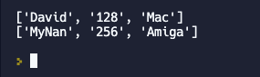

### Pretty Printing

Man, that `print(listOfShame)` output sure is ug-leeee.

👉 In the code below, I've added a `prettyPrint` subroutine to beautify the output. Remember, we did this before on Day 34.

```python
def prettyPrint():
  print() 
  # Puts a blank row at the top
  for row in listOfShame: 
    #loops to the next row when the end of the current one is reached
     print(row) 
    # prints the new row
  print() 
  # prints a blank line between rows
    

listOfShame = [] 

while True: 
  name = input("What is your name? ")
  age = input("What is your age? ")
  pref = input("What is your computer platform? ")
  
  row = [name, age, pref] 

  listOfShame.append(row) 

  exit = input("Exit? y/n") 

  if (exit.strip().lower()[0] == "y"):
    break 

prettyPrint() 
# Call the prettyPrint subroutine instead of printing the list directly. 
```
This code would produce an output like this


There is a bit of weirdness. The rows are printing out, but they just look like a list with all those symbols. We need one loop to extract each row and one loop to extract each item from the columns.

## Prettier Printing?

👉 This version of `prettyPrint()` uses fStrings to further line up the tabs.

*Note: this only shows the updated subroutine (not the entire code).*

```python
def prettyPrint():
  print() 
  for row in listOfShame: 
    for item in row: 
      # item refers to each item in the column for that row
     print(f"{item:^10}", end=" | ") 
      # :^10 means 10 characters as the space with the data in the center. The end character has been changed to space vertical line space to make it look more like a table.
      
    print() 
    
  print() 
```
This code would produce an output like this


### Play around with pretty printing. Don't forget, you can now use this subroutine for all of your other lists!