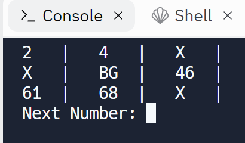
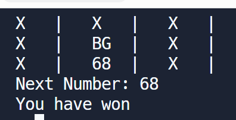

# 👉 Day 44 Challenge

It's time for more bingo! You can reuse your code from day 43, but this time add the following features:

1. Repeatedly ask the user what number comes up next.
2. Check the bingo card to see if the number picked matches one on the card.
3. If the bingo card is all 'X's, then the user has won.

Example:

 
 💡 Hints 

  
- Create a subroutine called `createCard` to clean up some of the code from Day 43.
- Use a variable and loop to store how many x's there are on the card.  Add one every time a number is replaced.
- Check the variable every time to see if it has reached the magic winning number.

